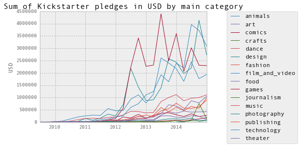

#Kickstarter

I created this Capstone project for the General Assembly course that I took in the spring of 2015.  I used python (scikit learn, pandas, numpy) to predict whether or not a Kickstarter project would be funded as well as the amount of funding per Kickstarter category over time. 

The presentation of the results is [here](Kickstarter%20presentation.pdf).

##Exploring the data

##Predicting whether or not a Kickstarter project would be funded

## Predicting the amount of funding by Kickstarter category

###Technology

###Gaming

###Art

###Design

###Fashion

###Filma and Videos

###Crafts

###Dance

###Food

