#Kickstarter

I created this Capstone project for the General Assembly course that I took in the spring of 2015.  I used python (scikit learn, pandas, numpy) to predict whether or not a Kickstarter project would be funded as well as the amount of funding per Kickstarter category over time. 

The presentation of the results is [here](Kickstarter%20presentation.pdf).
The python code used for the analysis is [here](kickstarter.py) and [here](kickstarter_time_series_prediction.py)

##Data scrubbing and manipulation
Data scrubbing
* Fixed data alignment
* Fixed main categories and sub-categories

Data manipulations
* Converted pledged and goals to USDs
* Converted dates to quarters using resample()
* Created a time-series lag component based on proportion funded in previous quarter
* Created a subjectivity and polarity rating of the project description using TextBlob()

##Exploring the data
I first looked at how project funding has changed over time.  I saw that there was a dramatic increase in funding around 2012.  I looked at both the proportion of projects funded and proportion of pledged dollars as well.  We see that starting in 2012 that that proportion of projects funded peaks and that the proportion of pledged dollars is over 100%.  In early 2013, the amount of projects increases while we see a decrease in the amount of funding in both the proportion of projects funded and proportion of dollars pledged.  Meanwhile, there is a dramatic increase in the amount of the proposed projects goals (in dollars).

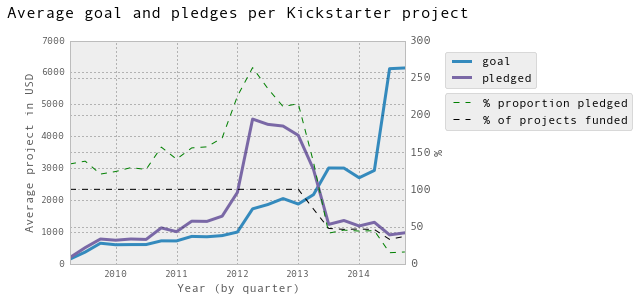

I looked at the relationship between the log sum of the amounts in both the goals and pledges over time in comparison to the number of projects.  This again highlights the change in both proposed projects and funding in early 2013. 

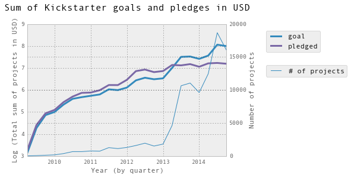

I examined the frequency of the number of backers for each project.  As expected, most projects have a few number of backers while there are few projects that have a high number of backers.

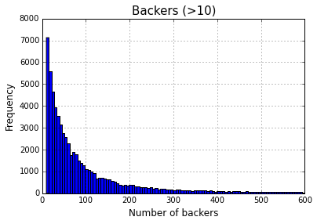

I also compared the number of backers for projects that were funded versus those that were not funded.  Not suprisingly, the projects that were funded had more backers.

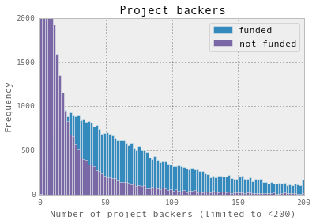

Each project has a category.  I looked at the distribution of categories over time (by quarter).  The figure (messy!) shows that the categories with the highest pledged dollars are technology, gaming, design, and film and videos.

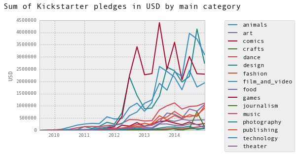

Each project also has a description to try to convice backers to support the project.  I used TextBlob, a text processing library in python to look at the distribution of polarity and subjectivity of the project description.

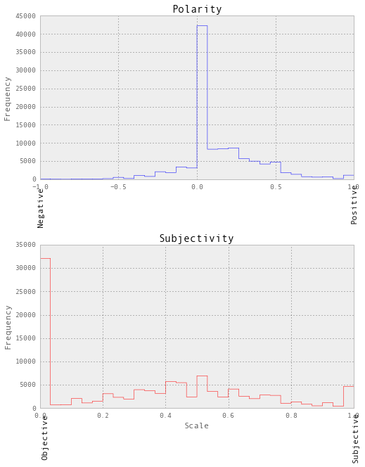

##Predicting whether or not a Kickstarter project would be funded

I trained the on the Kickstarter data from 2009 to 2014 and then tested it on the first quarter of 2015.  I used recursive feature elimination (RFE) to identify the best features to use.  The most import features were number of backers, project goal, proportion of features funded in the previous quarter, and currency.

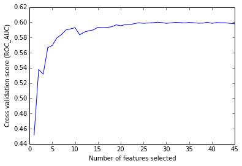

I used the Random Forest, Decision Tree, and Extra Forest models to test which could most accurately predict whether a project was funded or not.  I found that the Random Forest model was the most accurate based on the ROC score.

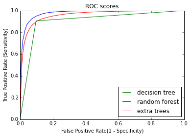

This felt like cheating though.  Of course, using the number of backers in the model will make for an accurate prediction.  In fact, I found that my model was 96% accurate just using the amount of the goal and number of backers.

When I removed the number of backers, I still found that the Random Forest was the best model to predict whether a project would be funded or not (based on ROC score).  I found using RFE that the most important features were goal, polarity, and subjectivity.  When I tested the data on the 2015 1st quarter data, I found the model to be 63.4% accurate.  

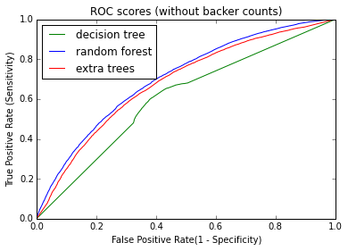

## Predicting the amount of funding by Kickstarter category
I then used a time series linear regression predictive model for each category to predict how funding would change over time.  The r-squared (on each figure) indicates the goodness of fit of each model.  The models that had more consistent time series data had more consistent predictions.

###Technology
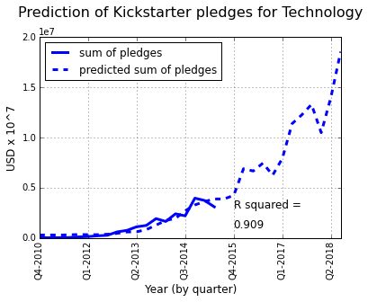
###Gaming
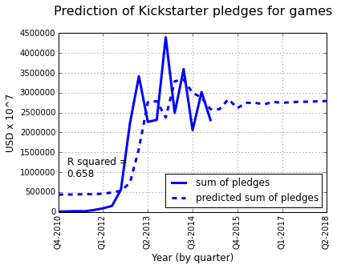
###Film and Videos
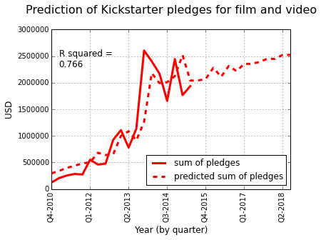
###Design
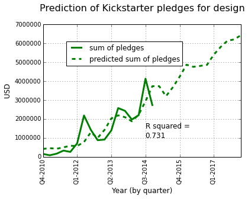
###Art
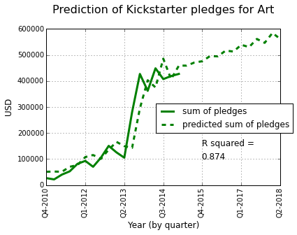
###Fashion
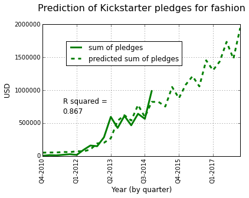
###Crafts
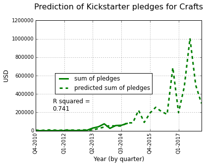
###Dance
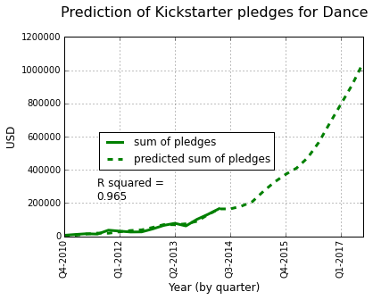
###Food
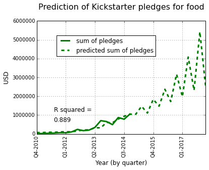

